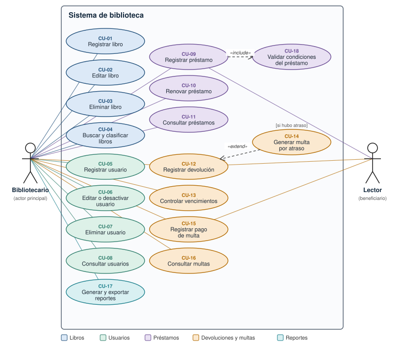

# 4. Casos de uso

## 4.1 Diagrama de casos de uso

> Los casos de uso CU-09, CU-12 y CU-15 involucran al **Lector** como beneficiario del servicio, pero el sistema lo opera el **Bibliotecario**. CU-09 **incluye** siempre CU-18 (validar condiciones del préstamo); CU-14 **extiende** a CU-12 solo cuando la devolución tiene atraso. El sistema lee y escribe en los **archivos JSON** en todos los casos de uso que crean o modifican información.

## 4.2 Resumen de casos de uso

| ID | Caso de uso | Actor principal | Requisitos |
|---|---|---|---|
| CU-01 | Registrar libro | Bibliotecario | RF-01, RF-04, RF-07, RF-29 |
| CU-02 | Editar libro | Bibliotecario | RF-02, RF-07, RF-29 |
| CU-03 | Eliminar libro | Bibliotecario | RF-06, RF-29 |
| CU-04 | Buscar y clasificar libros | Bibliotecario | RF-03, RF-04, RF-05 |
| CU-05 | Registrar usuario | Bibliotecario | RF-08, RF-10, RF-29 |
| CU-06 | Editar o desactivar usuario | Bibliotecario | RF-09, RF-10, RF-11, RF-29 |
| CU-07 | Eliminar usuario | Bibliotecario | RF-11, RF-29 |
| CU-08 | Consultar usuarios | Bibliotecario | RF-09 |
| CU-09 | Registrar préstamo | Bibliotecario (Lector) | RF-12, RF-13, RF-14, RF-15, RF-05, RF-29 |
| CU-10 | Renovar préstamo | Bibliotecario | RF-16, RF-29 |
| CU-11 | Consultar préstamos | Bibliotecario | RF-17, RF-19 |
| CU-12 | Registrar devolución | Bibliotecario (Lector) | RF-18, RF-05, RF-29 |
| CU-13 | Controlar vencimientos | Bibliotecario | RF-19 |
| CU-14 | Generar multa por atraso (extiende CU-12) | Sistema | RF-20 |
| CU-15 | Registrar pago de multa | Bibliotecario (Lector) | RF-21, RF-29 |
| CU-16 | Consultar multas | Bibliotecario | RF-22 |
| CU-17 | Generar y exportar reportes | Bibliotecario | RF-23 a RF-28 |
| CU-18 | Validar condiciones del préstamo (incluido en CU-09) | Sistema | RF-12, RF-14, RF-15 |

## 4.3 Especificación de los casos de uso principales

### CU-01 Registrar libro

| Campo | Descripción |
|---|---|
| **Actor** | Bibliotecario |
| **Precondición** | La aplicación está abierta en el módulo *Libros*. |
| **Flujo principal** | 1. El bibliotecario pulsa **Nuevo libro**. 2. El sistema muestra el formulario. 3. El bibliotecario ingresa ISBN, título, autor, editorial, año, categoría y ejemplares. 4. Pulsa **Guardar**. 5. El sistema valida los datos, verifica que el ISBN no exista y guarda el libro en `libros.json`. 6. El sistema muestra el mensaje de confirmación y actualiza la tabla. |
| **Flujos alternos** | 5a. Dato inválido o ISBN repetido: el sistema muestra el error en el formulario y no guarda.   4a. El bibliotecario pulsa **Cancelar**: no se guarda nada. |
| **Postcondición** | El libro queda registrado con todos sus ejemplares disponibles. |

### CU-09 Registrar préstamo

| Campo | Descripción |
|---|---|
| **Actores** | Bibliotecario (opera), Lector (solicita) |
| **Precondición** | Existen al menos un usuario activo y un libro con ejemplares disponibles. |
| **Flujo principal** | 1. El bibliotecario pulsa **Nuevo préstamo**. 2. Selecciona el usuario y el libro. 3. El sistema muestra el plazo, la fecha de devolución y los préstamos activos del usuario. 4. El bibliotecario pulsa **Registrar préstamo**. 5. El sistema ejecuta CU-18 (validar condiciones). 6. El sistema descuenta un ejemplar, registra el préstamo con su fecha de vencimiento y guarda `prestamos.json` y `libros.json`. 7. El sistema muestra la confirmación con la fecha de devolución. |
| **Flujos alternos** | 5a. El usuario está inactivo, tiene multas pendientes, tiene libros atrasados, alcanzó su límite, ya tiene ese libro o no quedan ejemplares: el sistema muestra el motivo y no registra el préstamo. |
| **Postcondición** | Existe un préstamo en estado *Activo* y el libro tiene un ejemplar menos disponible. |

### CU-10 Renovar préstamo

| Campo | Descripción |
|---|---|
| **Actor** | Bibliotecario |
| **Precondición** | Existe un préstamo en estado *Activo* (no atrasado ni devuelto). |
| **Flujo principal** | 1. El bibliotecario selecciona el préstamo y pulsa **Renovar préstamo**. 2. El sistema pide confirmación. 3. Al confirmar, el sistema agrega al vencimiento el plazo del tipo de usuario, incrementa el contador de renovaciones y guarda `prestamos.json`. 4. Muestra la nueva fecha de devolución. |
| **Flujos alternos** | 3a. Ya se usaron las 2 renovaciones permitidas: el sistema muestra el error y no cambia el préstamo. |
| **Postcondición** | El vencimiento se extendió y el préstamo sigue *Activo*. |

### CU-12 Registrar devolución

| Campo | Descripción |
|---|---|
| **Actores** | Bibliotecario (opera), Lector (entrega) |
| **Precondición** | Existe un préstamo sin devolver (*Activo* o *Atrasado*). |
| **Flujo principal** | 1. El bibliotecario abre **Devoluciones y multas**, selecciona el préstamo y pulsa **Registrar devolución**. 2. El sistema muestra los días de atraso y la multa estimada, si los hay, y pide confirmación. 3. Al confirmar, el sistema registra la fecha de devolución, libera el ejemplar del libro y guarda los archivos. 4. Si hubo atraso, ejecuta CU-14. 5. Muestra el resultado de la operación. |
| **Flujos alternos** | 2a. El préstamo ya había sido devuelto: el sistema informa el error. |
| **Postcondición** | El préstamo queda *Devuelto*, el libro recupera el ejemplar y, si hubo atraso, existe una multa pendiente. |

### CU-14 Generar multa por atraso

| Campo | Descripción |
|---|---|
| **Actor** | Sistema (extiende a CU-12 solo cuando hay atraso) |
| **Precondición** | Se está registrando la devolución de un préstamo con fecha posterior al vencimiento. |
| **Flujo principal** | 1. El sistema calcula los días de atraso (fecha de devolución − fecha de vencimiento). 2. Calcula el monto con la política de multa (Q2.00 por día, máximo Q100.00). 3. Crea la multa en estado *Pendiente* y la guarda en `multas.json`. |
| **Postcondición** | El usuario queda bloqueado para nuevos préstamos hasta pagar la multa. |

### CU-15 Registrar pago de multa

| Campo | Descripción |
|---|---|
| **Actores** | Bibliotecario (opera), Lector (paga) |
| **Precondición** | Existe una multa *Pendiente*. |
| **Flujo principal** | 1. En la pestaña **Multas**, el bibliotecario selecciona la multa y pulsa **Registrar pago**. 2. El sistema pide confirmación. 3. Al confirmar, marca la multa como *Pagada* con la fecha actual y guarda `multas.json`. |
| **Postcondición** | Si no quedan otras multas pendientes, el usuario puede volver a solicitar préstamos. |

### CU-17 Generar y exportar reportes

| Campo | Descripción |
|---|---|
| **Actor** | Bibliotecario |
| **Flujo principal** | 1. El bibliotecario abre **Reportes** y elige uno de los cinco reportes. 2. El sistema lo calcula con los datos actuales y lo muestra en una tabla con su resumen. 3. Opcionalmente pulsa **Exportar a CSV**, elige el destino y el sistema guarda el archivo. |
| **Flujos alternos** | 3a. No se puede escribir en el destino: el sistema muestra un mensaje de error. |
| **Postcondición** | El reporte se visualizó y, si se pidió, se guardó como archivo CSV. |
