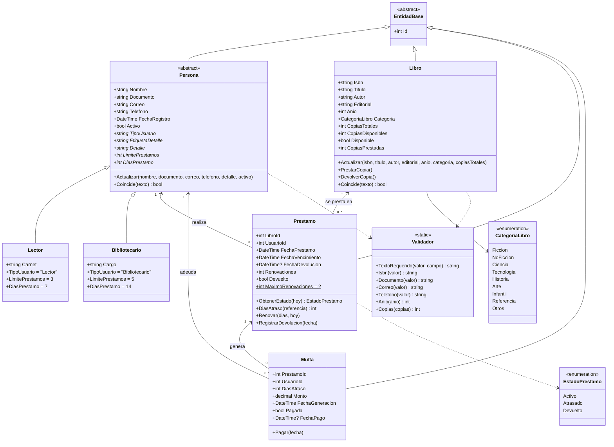
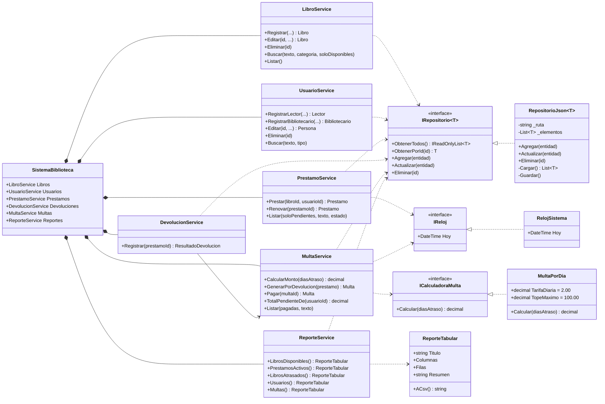
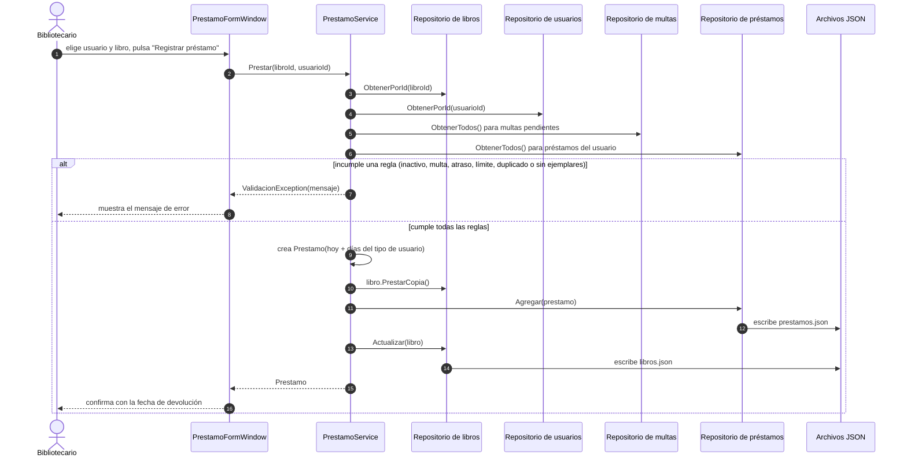
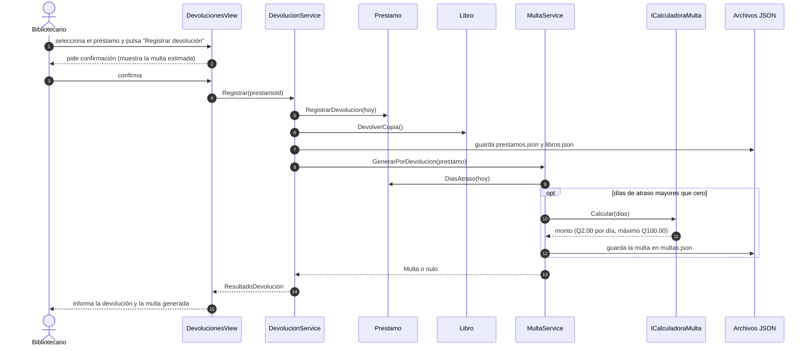
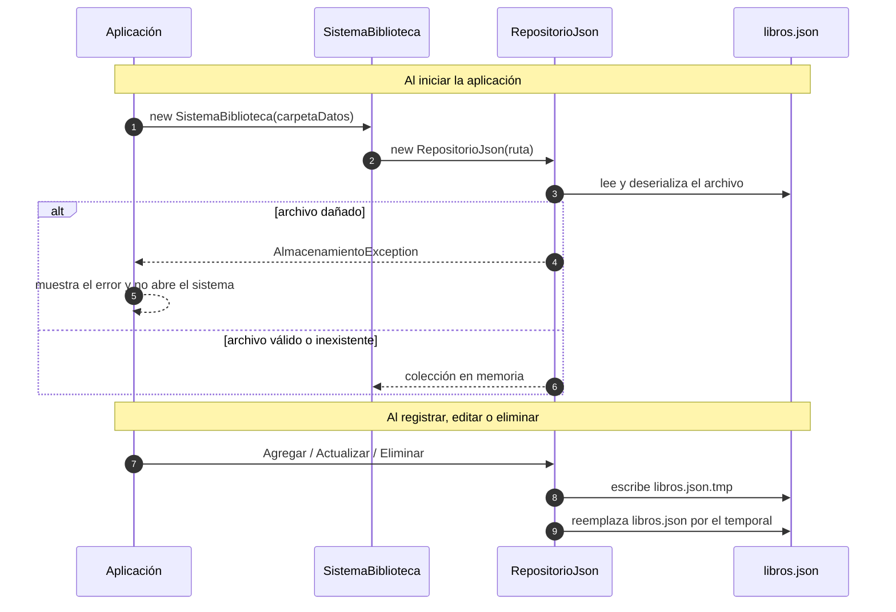
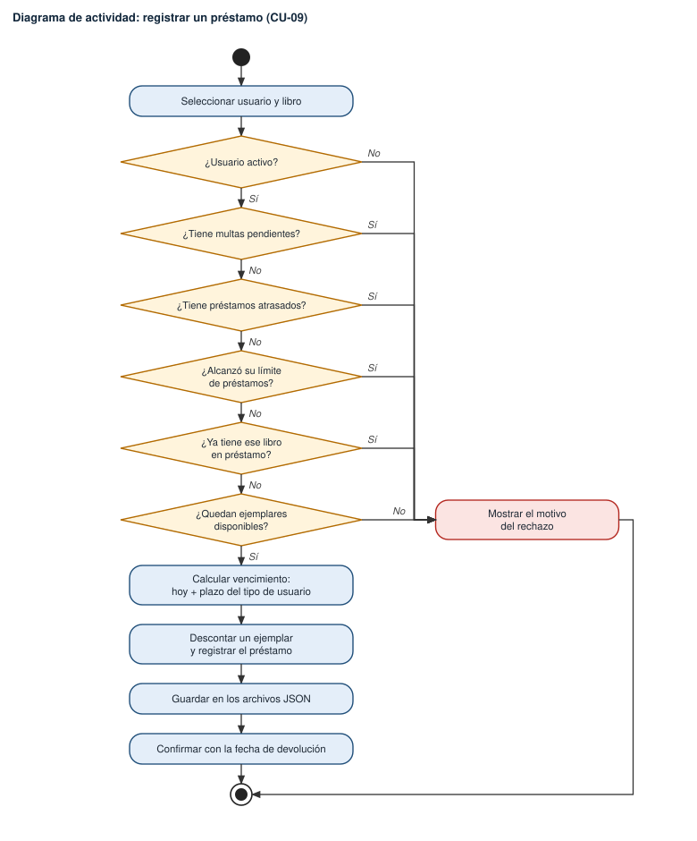
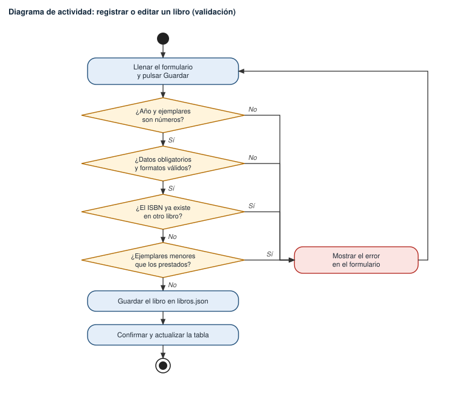
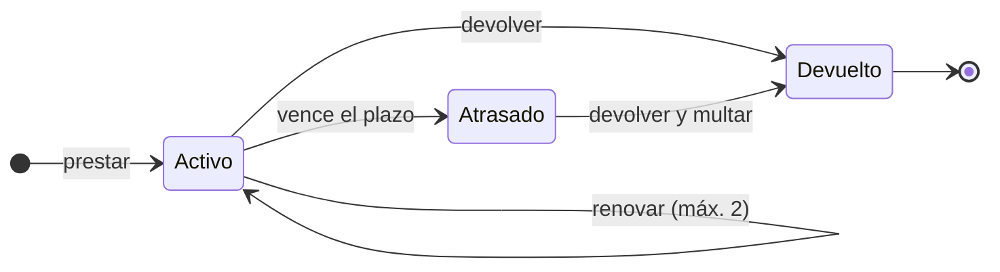

# 5. Diagramas UML

El diagrama de casos de uso se presentó en el capítulo 4. Este capítulo contiene los diagramas de **clases**, **secuencia**, **actividad** y **estados**, además de la vista de **arquitectura**. Los diagramas de clases, secuencia, estados y arquitectura están escritos como código Mermaid (GitHub los muestra directamente y se versionan junto con el código); los de actividad se dibujaron como imágenes SVG.

## 5.1 Diagrama de clases del dominio

Es el modelo que se implementó en `src/Biblioteca.Core/Modelos`. `EntidadBase` aporta el identificador que usa la persistencia; `Persona` es abstracta y sus subclases definen, por **polimorfismo**, cuántos libros puede llevar cada usuario y por cuántos días.

## 5.2 Diagrama de clases de servicios y persistencia

Muestra cómo se conectan la lógica y el almacenamiento. Los servicios dependen de **interfaces** (`IRepositorio<T>`, `IReloj`, `ICalculadoraMulta`), lo que permite cambiar el almacenamiento, controlar la fecha en las pruebas o sustituir la política de multas sin tocar el resto del sistema.

## 5.3 Diagramas de secuencia

### Registrar un préstamo (CU-09)

### Registrar una devolución con multa (CU-12 y CU-14)

### Guardar y recuperar información (persistencia)

## 5.4 Diagramas de actividad

### Registrar un préstamo

### Registrar una devolución y generar la multa

### Registrar o editar un libro (validación de datos)

## 5.5 Diagrama de estados del préstamo

## 5.6 Arquitectura de la solución

La solución está dividida en tres proyectos con dependencias en un solo sentido (interfaz → lógica). La lógica no conoce la interfaz, por eso se puede probar de forma automática.

```mermaid
flowchart TB
    subgraph APP["Biblioteca.App · Presentación (Avalonia)"]
        direction LR
        V1[MainWindow]
        V2[Vistas: Libros, Usuarios, Préstamos, Devoluciones, Reportes]
        V3[Formularios y diálogos]
    end

    subgraph CORE["Biblioteca.Core · Lógica y dominio"]
        direction LR
        S[Servicios]
        M[Modelos]
        P[Políticas: multa y reloj]
        R[RepositorioJson]
    end

    subgraph DATA["Archivos JSON · carpeta datos"]
        direction LR
        F1[(libros.json)]
        F2[(usuarios.json)]
        F3[(prestamos.json)]
        F4[(multas.json)]
    end

    T["Biblioteca.Tests · pruebas xUnit"]

    APP -->|usa SistemaBiblioteca| S
    S --> M
    S --> P
    S --> R
    R --> F1 & F2 & F3 & F4
    T -.->|prueba| CORE
```

