# 6. Descripción de las principales clases

Las clases del código tienen correspondencia directa con el diagrama de clases del capítulo 5 (RNF-11).

## 6.1 Modelos del dominio (`Biblioteca.Core/Modelos`)

| Clase | Responsabilidad | Atributos principales | Métodos principales |
|---|---|---|---|
| `EntidadBase` (abstracta) | Base de todo lo que se guarda en JSON; aporta el identificador. | `Id` (asignado por el repositorio). | `AsignarId` (interno). |
| `Persona` (abstracta) | Datos comunes de quien usa la biblioteca y reglas de préstamo que cada tipo concreta. | `Nombre`, `Documento`, `Correo`, `Telefono`, `FechaRegistro`, `Activo`. | `Actualizar`, `Coincide`; miembros abstractos `TipoUsuario`, `LimitePrestamos`, `DiasPrestamo`, `Detalle`. |
| `Lector` | Usuario que solicita libros. | `Carnet`. | Hereda de `Persona`: límite 3 préstamos, plazo 7 días. |
| `Bibliotecario` | Personal de la biblioteca (también puede pedir libros). | `Cargo`. | Hereda de `Persona`: límite 5 préstamos, plazo 14 días. |
| `Libro` | Título del catálogo con su inventario de ejemplares. | `Isbn`, `Titulo`, `Autor`, `Editorial`, `Anio`, `Categoria`, `CopiasTotales`, `CopiasDisponibles`. | `Actualizar`, `PrestarCopia`, `DevolverCopia`, `Coincide`; calculadas `Disponible`, `CopiasPrestadas`. |
| `Prestamo` | Registro de un libro prestado a un usuario. | `LibroId`, `UsuarioId`, `FechaPrestamo`, `FechaVencimiento`, `FechaDevolucion`, `Renovaciones`. | `ObtenerEstado`, `DiasAtraso`, `Renovar`, `RegistrarDevolucion`. |
| `Multa` | Cobro generado por devolver con atraso. | `PrestamoId`, `UsuarioId`, `DiasAtraso`, `Monto`, `FechaGeneracion`, `Pagada`, `FechaPago`. | `Pagar`. |
| `Validador` (estática) | Reglas de validación compartidas (ISBN, DPI, correo, teléfono, año, ejemplares). | — | `Isbn`, `Documento`, `Correo`, `Telefono`, `TextoRequerido`, `Anio`, `Copias`. |
| `CategoriaLibro`, `EstadoPrestamo` | Enumeraciones de clasificación y de estado. | — | `Texto()` (nombre legible de la categoría). |

## 6.2 Conceptos de POO aplicados

| Concepto | Dónde se aplica |
|---|---|
| **Clases y objetos** | `Libro`, `Persona`, `Prestamo`, `Multa` y los servicios. |
| **Encapsulamiento** | Todas las propiedades tienen `set` privado; el estado solo cambia mediante métodos que validan (por ejemplo `Libro.PrestarCopia()` no permite bajar de cero ejemplares). |
| **Constructores** | Los constructores públicos validan los datos; un constructor privado sin parámetros lo usa el deserializador JSON. |
| **Propiedades** | Propiedades de solo lectura desde fuera y propiedades calculadas (`Libro.Disponible`, `Prestamo.Devuelto`). |
| **Métodos** | Comportamiento de negocio en las entidades (`Renovar`, `RegistrarDevolucion`, `Pagar`) y en los servicios. |
| **Herencia** | `Persona` → `Lector` / `Bibliotecario`; `EntidadBase` → `Persona`, `Libro`, `Prestamo`, `Multa`. |
| **Polimorfismo** | `LimitePrestamos` y `DiasPrestamo` se resuelven según el tipo concreto de `Persona`; `PrestamoService` los usa sin preguntar el tipo. La colección `List<Persona>` se guarda y se recupera con su tipo real. |
| **Interfaces** | `IRepositorio<T>` (almacenamiento intercambiable), `IReloj` (fecha controlable en pruebas) e `ICalculadoraMulta` (política de multa sustituible). |
| **Genéricos** | `RepositorioJson<T>` sirve para las cuatro colecciones. |
| **Excepciones propias** | `ValidacionException` (regla de negocio incumplida) y `AlmacenamientoException` (problema con un archivo). |

## 6.3 Servicios (`Biblioteca.Core/Servicios`)

| Servicio | Responsabilidad |
|---|---|
| `LibroService` | Registrar, editar, eliminar, listar y buscar libros; garantiza ISBN único y bloquea la eliminación de libros con historial. |
| `UsuarioService` | Registrar lectores y bibliotecarios, editar, desactivar, eliminar y buscar; garantiza DPI y carnet únicos. |
| `PrestamoService` | Registrar préstamos aplicando todas las reglas del servicio, renovarlos y listarlos con nombres y estado resueltos (`PrestamoDetalle`). |
| `DevolucionService` | Registrar la devolución, liberar el ejemplar y disparar la generación de la multa. |
| `MultaService` | Calcular y generar multas, registrar pagos, consultar multas y saldos pendientes. |
| `ReporteService` | Construir los cinco reportes (`ReporteTabular`) y exportarlos a CSV. |
| `SistemaBiblioteca` | Punto de entrada: crea los repositorios JSON y los servicios; es lo único que los controladores necesitan conocer. |

## 6.4 Controladores, modelos de vista y vistas (`Biblioteca.Web`)

| Controlador | Acciones | Vistas (`Views/`) | Servicio que usa |
|---|---|---|---|
| `HomeController` | `Index` (panel), `Error` | `Home/Index`, `Shared/Error` | Todos (solo lectura) |
| `LibrosController` | `Index`, `Crear`, `Editar`, `Eliminar` | `Libros/Index`, `Crear`, `Editar`, `_Formulario` | `LibroService` |
| `UsuariosController` | `Index`, `Crear`, `Editar`, `Eliminar` | `Usuarios/Index`, `Crear`, `Editar`, `_Formulario` | `UsuarioService` |
| `PrestamosController` | `Index`, `Nuevo`, `Renovar` | `Prestamos/Index`, `Nuevo` | `PrestamoService` |
| `DevolucionesController` | `Index`, `Registrar` | `Devoluciones/Index` | `DevolucionService`, `MultaService` |
| `MultasController` | `Index`, `Pagar` | `Multas/Index` | `MultaService` |
| `ReportesController` | `Index`, `Exportar` | `Reportes/Index` | `ReporteService` |

- Todos heredan de `BaseController` (salvo `Home` y `Reportes`), que traduce `ValidacionException` y `AlmacenamientoException` en mensajes para el usuario.
- Los **modelos de vista** (`Models/ViewModels`) transportan los datos de los formularios (con validaciones `DataAnnotations`) y de los listados; las entidades del dominio nunca se enlazan directamente a un formulario.
- Las acciones que modifican datos son `POST` con `[ValidateAntiForgeryToken]`; después de guardar se redirige (patrón Post/Redirect/Get) y el mensaje se entrega con `TempData`.
- `SistemaBiblioteca` se registra como *singleton* en `Program.cs` y se inyecta por constructor en cada controlador.

---

# 7. Diseño de la persistencia en archivos JSON

## 7.1 Archivos

| Archivo | Contenido | Entidad |
|---|---|---|
| `libros.json` | Catálogo de libros con sus ejemplares. | `Libro` |
| `usuarios.json` | Lectores y bibliotecarios; cada objeto lleva `"tipo": "lector"` o `"bibliotecario"`. | `Persona` |
| `prestamos.json` | Historial completo de préstamos. | `Prestamo` |
| `multas.json` | Multas generadas y su estado de pago. | `Multa` |

Los archivos se guardan en la carpeta `Data/` de la aplicación web (o en la ruta indicada por la configuración `DataPath` o la variable de entorno `BIBLIOTECA_DATOS`). El repositorio incluye los **datos de prueba** en `Data/`.

## 7.2 Ejemplo de formato

```json
{
  "tipo": "lector",
  "carnet": "2026-0101",
  "nombre": "María Fernanda López",
  "documento": "2456789010101",
  "correo": "maria.lopez@ejemplo.com",
  "telefono": "55123401",
  "fechaRegistro": "2026-08-03T00:00:00",
  "activo": true,
  "id": 1
}
```

Solo se guardan los datos primarios: las propiedades calculadas (`LimitePrestamos`, `Disponible`, estado del préstamo, etc.) se recalculan al cargar, de modo que no puedan quedar desincronizadas.

## 7.3 Estrategia de lectura y escritura

1. **Al iniciar**, `RepositorioJson<T>` lee el archivo completo y lo deserializa a una lista en memoria. Si no existe o está vacío, comienza con una colección vacía.
2. **En cada cambio** (agregar, actualizar o eliminar) serializa la lista completa a `archivo.json.tmp` y luego reemplaza al archivo original. Así, un fallo a mitad de escritura no deja un archivo truncado.
3. **Identificadores:** `Id = máximo actual + 1`. Los identificadores de registros eliminados no se reutilizan mientras exista un registro con un identificador mayor.
4. **Errores:** un JSON dañado o un problema de disco se convierte en `AlmacenamientoException` con el nombre del archivo; al iniciar, la aplicación no arranca con datos incompletos y muestra el error; al guardar, el controlador muestra el mensaje al usuario.
5. **Codificación:** UTF-8, con sangría, sin escapar tildes ni «ñ», para que el archivo sea legible.

---

# 8. Interfaz web

La interfaz es una aplicación **ASP.NET Core MVC**: páginas Razor (`.cshtml`) con Tailwind CSS (cargado por CDN), que se abren desde el navegador. Las vistas no contienen lógica de negocio: los controladores llaman a los servicios y las vistas muestran el resultado. Cumple con lo mínimo solicitado:

| Requisito de interfaz | Cómo se cumple |
|---|---|
| Menú principal | Barra lateral con **Inicio, Libros, Usuarios, Préstamos, Devoluciones, Multas y Reportes**. |
| Botones de navegación | El menú lateral, el botón **+ Nuevo** de cada módulo, los botones **Cancelar** y los accesos rápidos del inicio. |
| Formularios de registro | Páginas de alta de libro, usuario y préstamo. |
| Consulta de información | Tablas con búsqueda, filtros por categoría, tipo o estado, y resúmenes. |
| Edición de información | Botón de ícono **Editar** (lápiz) en cada fila de libros y usuarios. |
| Eliminación | Botón de ícono **Eliminar** (papelera) en libros y usuarios, permitido solo sin historial. |
| Mensajes de confirmación | Cuadro de confirmación del navegador antes de eliminar, renovar, devolver o cobrar; alerta verde de éxito después de cada operación. |
| Mensajes de error | Alerta roja dentro del formulario con el motivo (validación o regla de negocio) y alerta roja tras una operación rechazada. |
| Validación de datos | Campos obligatorios, formatos (ISBN, DPI, correo, teléfono), números, unicidad y reglas de negocio, siempre validados en el servidor. |
| Interfaz clara y organizada | Diseño con menú lateral con íconos, tarjetas, tablas con insignias de estado, formularios en cuadrícula y alertas; se adapta a pantallas pequeñas (menú desplegable). |

### Inicio
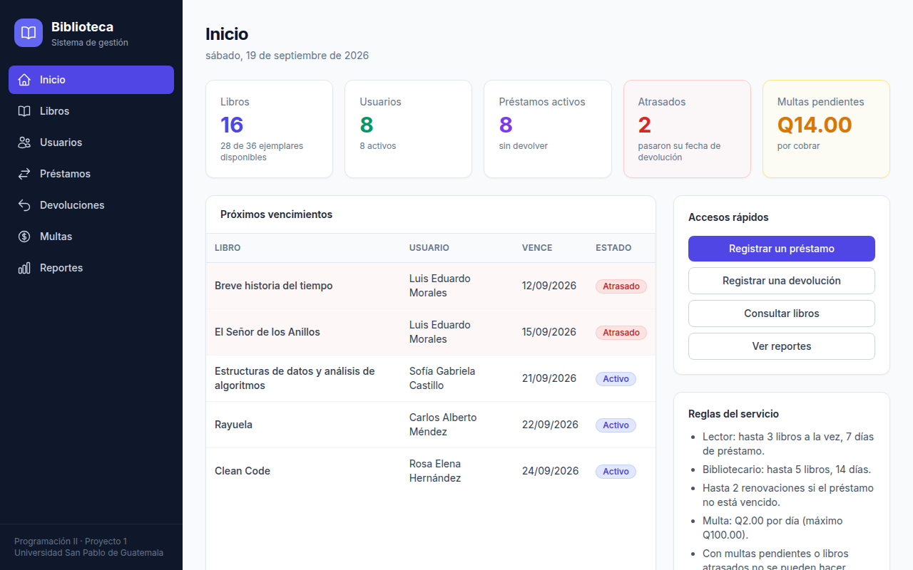

### Libros
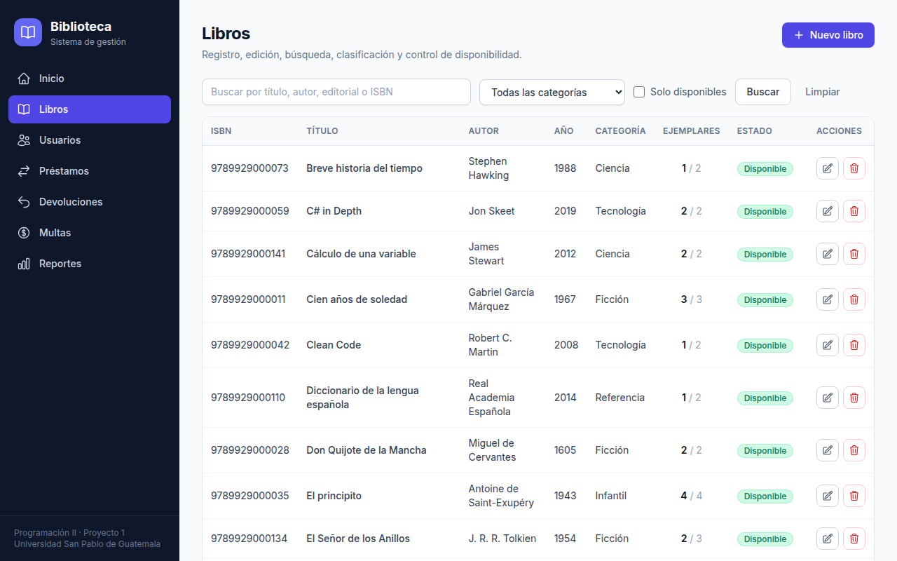

| Formulario | Validación |
|---|---|
| 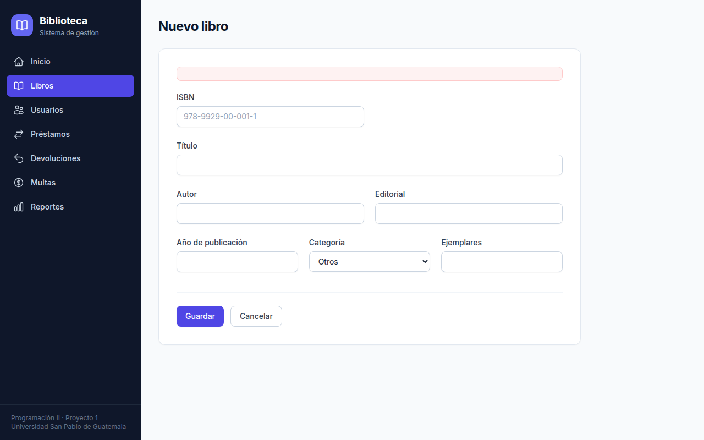 | 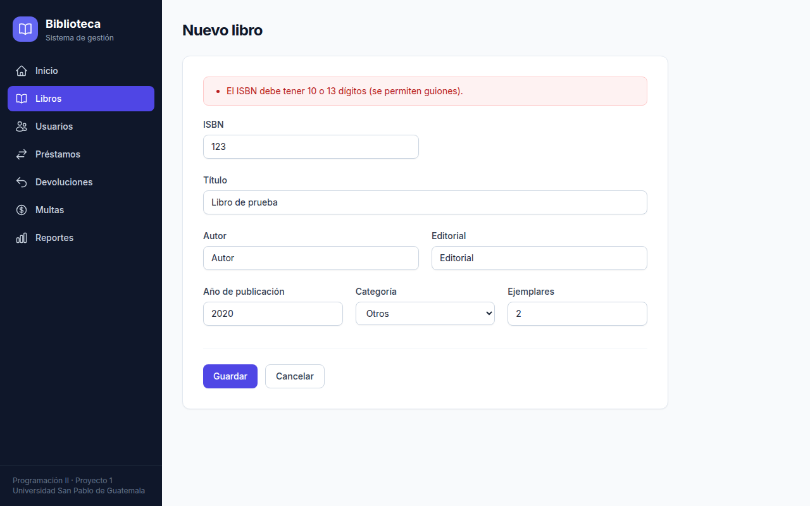 |

### Usuarios
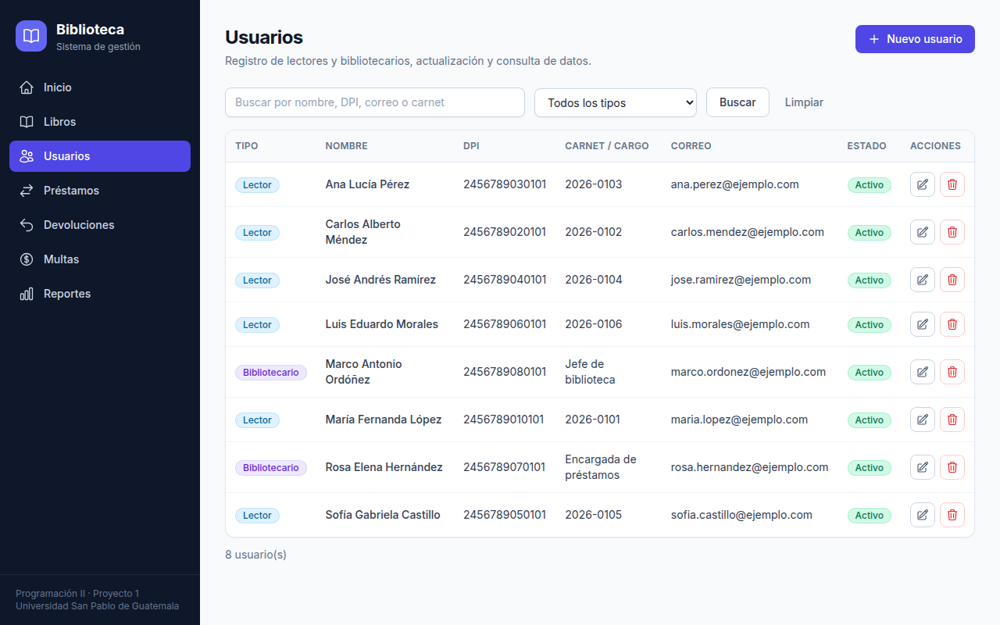

| Formulario | Validación |
|---|---|
| 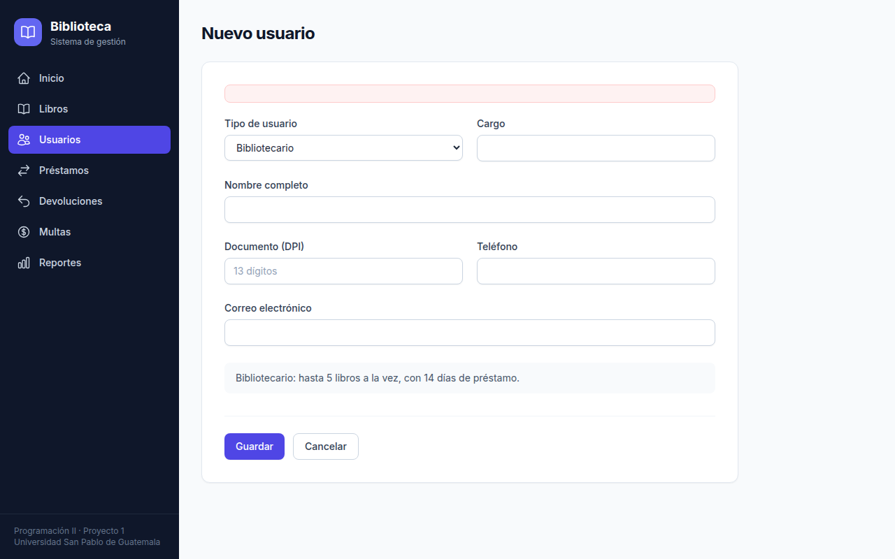 | 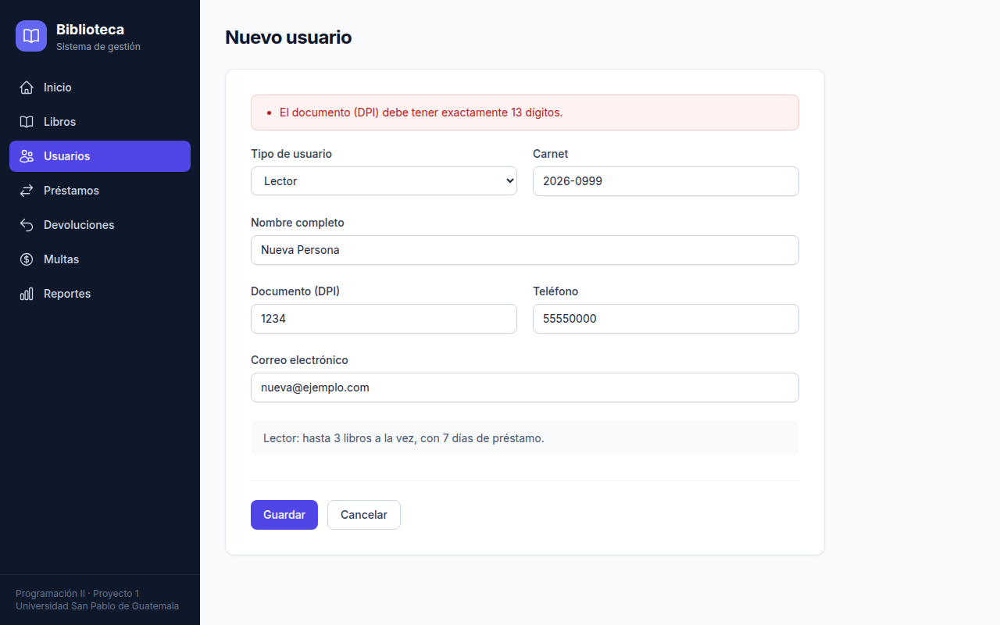 |

### Préstamos
Los préstamos atrasados se resaltan en rojo y los devueltos en gris.

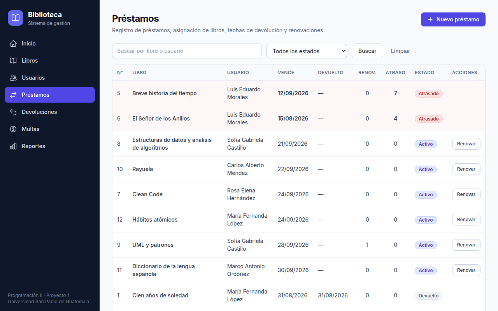

| Nuevo préstamo | Préstamo rechazado por regla de negocio |
|---|---|
| 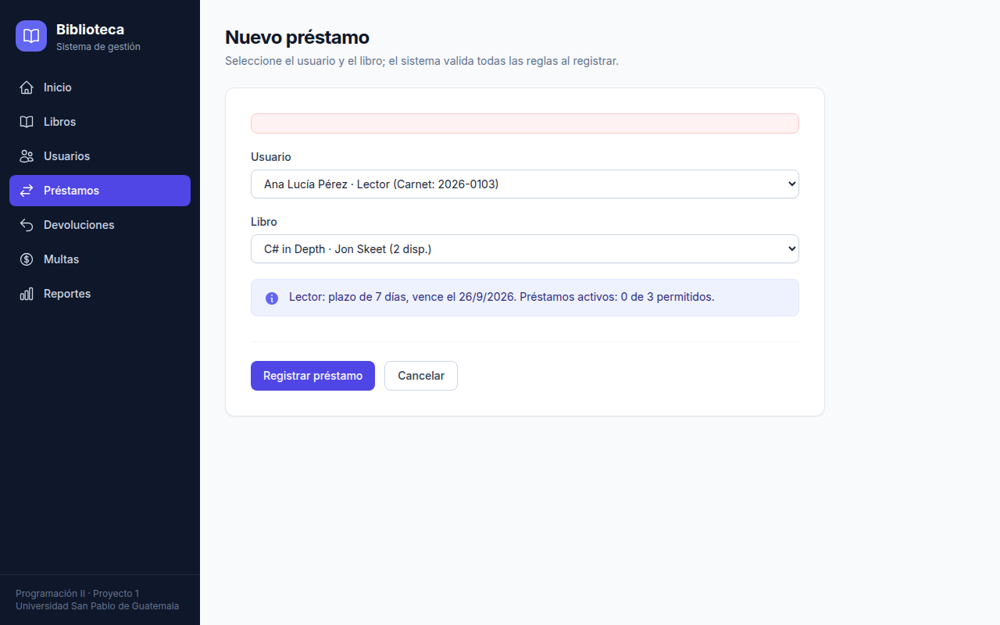 | 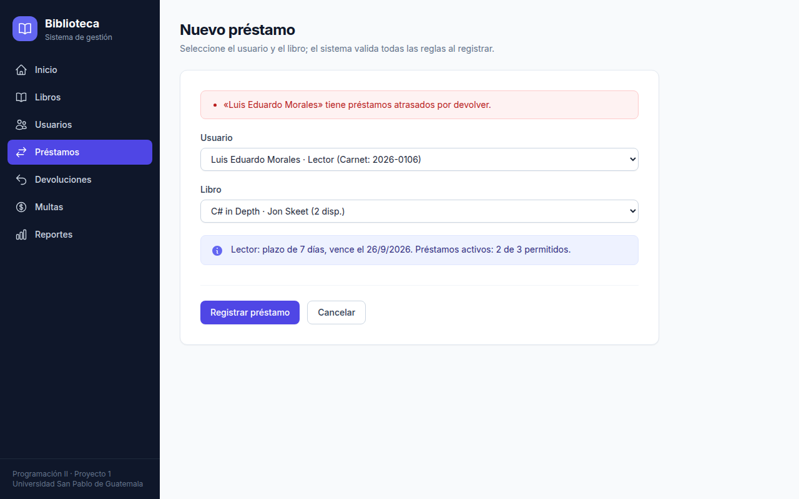 |

### Devoluciones y multas
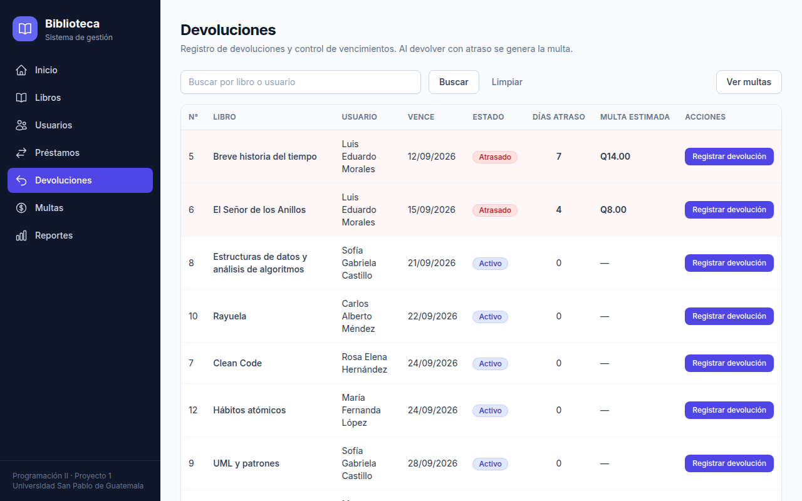

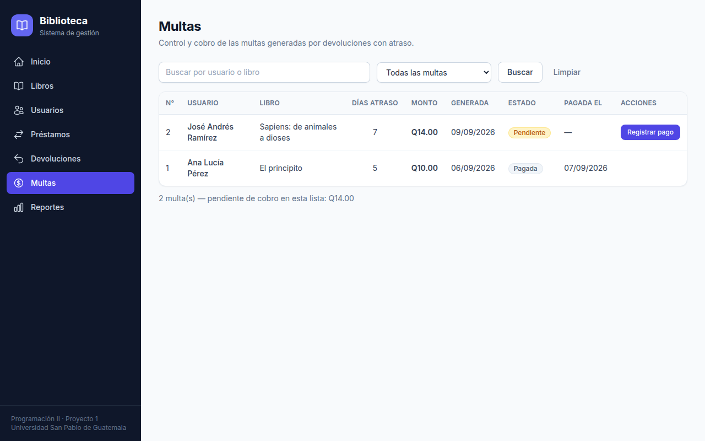

### Reportes
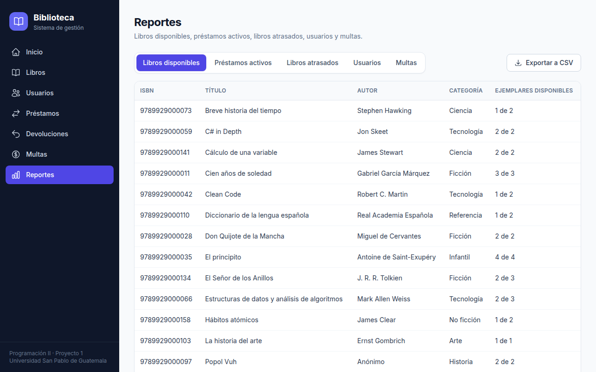

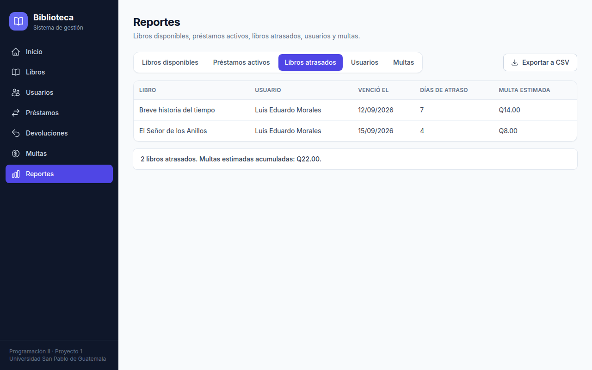

### Mensajes de confirmación y de error

| Confirmación | Error |
|---|---|
| 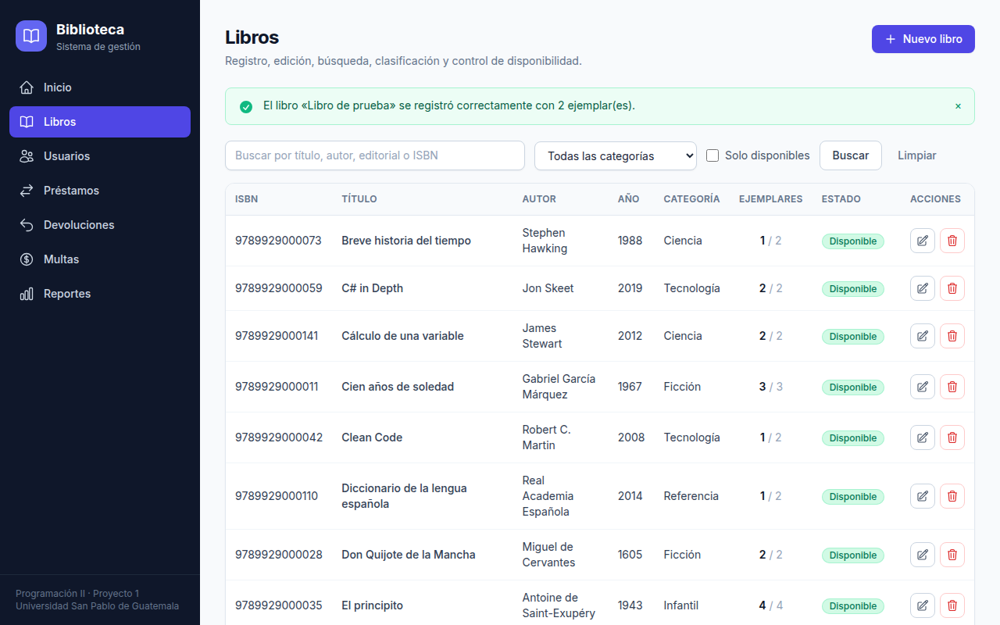 | 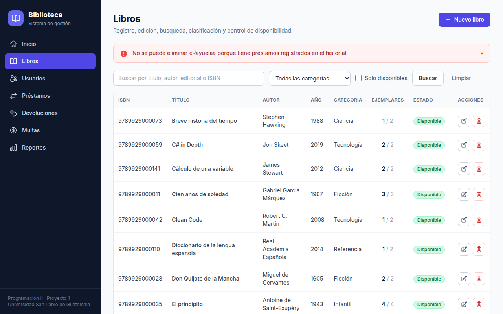 |

### Diseño adaptable (móvil)

| Listado | Menú desplegable |
|---|---|
| 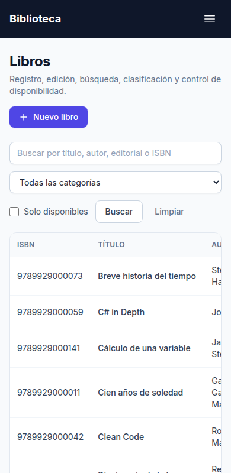 | 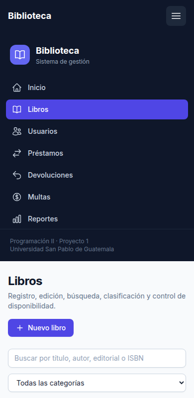 |

---

# 9. Trazabilidad

El proyecto demuestra la cadena **Problema → Requisitos → UML → Clases → Código C# → Interfaz → Archivos → Pruebas**.

## 9.1 Del problema a las clases

| Problema identificado | Requisitos | Casos de uso y diagramas UML | Clases |
|---|---|---|---|
| Catálogo sin control de disponibilidad | RF-01 a RF-07 | CU-01 a CU-04; diagrama de clases | `Libro`, `LibroService`, `Validador` |
| Usuarios sin registro ni límites | RF-08 a RF-11 | CU-05 a CU-08; herencia y polimorfismo | `Persona`, `Lector`, `Bibliotecario`, `UsuarioService` |
| Préstamos a quien no debe recibirlos | RF-12 a RF-17 | CU-09, CU-10, CU-11, CU-18; secuencia, actividad y estados del préstamo | `Prestamo`, `PrestamoService` |
| Vencimientos y multas sin control | RF-18 a RF-22 | CU-12 a CU-16; secuencia y actividad de devolución | `DevolucionService`, `MultaService`, `Multa`, `ICalculadoraMulta`, `MultaPorDia` |
| Reportes lentos y propensos a error | RF-23 a RF-28 | CU-17 | `ReporteService`, `ReporteTabular` |
| Información que se pierde | RF-29 a RF-31 | Secuencia de persistencia | `IRepositorio<T>`, `RepositorioJson<T>`, `AlmacenamientoException` |
| Uso poco claro del sistema | RF-32 a RF-34 | Especificación de casos de uso; arquitectura MVC | `BaseController`, controladores, vistas y modelos de vista |

## 9.2 De las clases a la interfaz, los archivos y las pruebas

| Requisitos | Código C# | Controlador y vistas | Archivo | Pruebas |
|---|---|---|---|---|
| RF-01 a RF-07 | `LibroService.Registrar/Editar/Eliminar/Buscar`, `Libro.PrestarCopia/DevolverCopia` | `LibrosController`, `Views/Libros` | `libros.json` | `LibroTests`, `LibroServiceTests`, `WebTests` |
| RF-08 a RF-11 | `Persona.Actualizar`, `LimitePrestamos`, `DiasPrestamo` | `UsuariosController`, `Views/Usuarios` | `usuarios.json` | `PersonaTests`, `UsuarioServiceTests`, `WebTests` |
| RF-12 a RF-17 | `PrestamoService.Prestar/Renovar`, `Prestamo.Renovar/ObtenerEstado` | `PrestamosController`, `Views/Prestamos` | `prestamos.json` | `PrestamoTests`, `PrestamoFlujoTests`, `WebTests` |
| RF-18 a RF-22 | `DevolucionService.Registrar`, `MultaService.GenerarPorDevolucion/Pagar` | `DevolucionesController`, `MultasController`, `Views/Devoluciones`, `Views/Multas` | `multas.json`, `prestamos.json` | `MultaTests`, `PrestamoFlujoTests`, `WebTests` |
| RF-23 a RF-28 | `ReporteService.*`, `ReporteTabular.ACsv` | `ReportesController`, `Views/Reportes` | (lee los cuatro archivos) | `ReporteServiceTests`, `WebTests` |
| RF-29 a RF-31 | `RepositorioJson.Cargar/Guardar` | `BaseController` (mensajes de error) | Los cuatro archivos JSON | `PersistenciaTests`, `DatosDePruebaTests` |
| RF-32 a RF-34 | `BaseController`, `Program.cs` | `Views/Shared/_Layout`, formularios y alertas | — | `WebTests` |

---

# 10. Pruebas

## 10.1 Pruebas automatizadas

El proyecto `tests/Biblioteca.Tests` contiene **94 casos de prueba** (xUnit) que se ejecutan con `dotnet test`: 70 del dominio, los servicios y la persistencia, y 24 de integración que arrancan la aplicación web completa en memoria:

| Grupo | Qué verifica |
|---|---|
| `LibroTests` | Validación de ISBN, año y ejemplares; disponibilidad; edición sin bajar de los ejemplares prestados; búsqueda. |
| `PersonaTests` | Polimorfismo (límites y plazos por tipo de usuario); validación de DPI, correo y teléfono; actualización. |
| `PrestamoTests` | Fecha de vencimiento; estados; días de atraso; renovaciones y su máximo; devolución única. |
| `MultaTests` | Cálculo de la multa (tarifa diaria, tope, casos límite); pago único. |
| `LibroServiceTests`, `UsuarioServiceTests` | Duplicados, edición, eliminación con y sin historial, búsqueda y filtros. |
| `PrestamoFlujoTests` | Flujo completo: préstamo, límite, bloqueos por multa o atraso, renovación, devolución a tiempo y con atraso, pago de la multa. |
| `ReporteServiceTests` | Contenido de los reportes y escape de comas y comillas en el CSV. |
| `PersistenciaTests` | Los datos sobreviven al cerrar y reabrir; se conserva el polimorfismo; los identificadores continúan; no quedan temporales; archivo dañado o vacío. |
| `DatosDePruebaTests` | Los datos de prueba cargan, son consistentes (ejemplares vs. préstamos) y cubren todos los estados. |
| `WebTests` | Las 12 páginas cargan con los datos de prueba; alta de libro y usuario con validaciones; eliminación con y sin historial; préstamo rechazado por atraso; préstamo, renovación y devolución; multa generada y pagada; exportación a CSV; rechazo de envíos sin token antiforgery. |

## 10.2 Datos de prueba

La carpeta `Data/` incluye 16 libros, 8 usuarios (6 lectores y 2 bibliotecarios), 12 préstamos y 2 multas. Se generaron con la propia lógica del sistema para que sean consistentes y cubren:

- Préstamos **activos**, **atrasados** y **devueltos** (a tiempo y con atraso).
- Un préstamo **renovado**.
- Un libro **sin ejemplares disponibles** (`Rayuela`).
- Una multa **pagada** y otra **pendiente** (que bloquea al usuario para nuevos préstamos).
- Un usuario con préstamos **atrasados** (`Luis Eduardo Morales`).
- Libros que se pueden **eliminar** (sin historial) y otros que no.

## 10.3 Pruebas manuales en el navegador

También se recorrieron 24 comprobaciones de extremo a extremo con un navegador Chrome automatizado (formularios, mensajes, confirmaciones, filtros y flujo completo de préstamo, devolución con multa y pago). Para repetirlas a mano:

1. Registrar un libro con un ISBN repetido y comprobar el mensaje de error.
2. Registrar un préstamo a un usuario con multa pendiente y comprobar el rechazo.
3. Devolver un préstamo atrasado y comprobar que se genera la multa correcta.
4. Pagar la multa y volver a prestar al mismo usuario.
5. Detener la aplicación, volver a ejecutarla y comprobar que los datos siguen ahí.
6. Exportar un reporte a CSV y abrirlo en una hoja de cálculo.

---

# 11. Uso de GitHub y ejecución del proyecto

## 11.1 Repositorio

Repositorio: <https://github.com/USPG-Angels-Workspace/sistema-biblioteca>

```
sistema-biblioteca/
├── Biblioteca.sln
├── Biblioteca.Web.csproj      aplicación web ASP.NET Core MVC
├── Program.cs                 configuración de la aplicación
├── Controllers/               controladores MVC
├── Models/                    modelos de vista (ViewModels)
├── Views/                     vistas Razor (.cshtml)
├── wwwroot/                   archivos estáticos (los estilos vienen de Tailwind por CDN)
├── Data/                      archivos JSON con los datos de prueba
├── docs/                      documento de análisis, diagramas, imágenes y presentación
├── src/
│   └── Biblioteca.Core/       dominio, servicios y persistencia (el "Modelo")
└── tests/
    └── Biblioteca.Tests/      pruebas unitarias y de integración (xUnit)
```

## 11.2 Flujo de trabajo

- Los commits siguen **Conventional Commits** con la descripción en español (`feat`, `fix`, `docs`, `chore`, `test`…).
- Cada commit contiene un solo cambio lógico y el historial se construyó por capas: estructura base → dominio → persistencia → servicios → pruebas → interfaz → documentación. Cuando el proyecto pasó a ser una aplicación web MVC, el cambio se hizo también por capas (plantilla → modelos de vista → controladores → vistas → pruebas de integración).

## 11.3 Cómo ejecutar

Requisitos: .NET SDK 8 o superior.

```bash
dotnet build Biblioteca.sln
dotnet test tests/Biblioteca.Tests
dotnet run
```

`dotnet run` inicia el servidor y muestra la dirección (por defecto `http://localhost:5110`); se abre en el navegador. Los cambios se guardan en `Data/`; para volver a los datos de prueba originales basta con `git checkout Data`.
