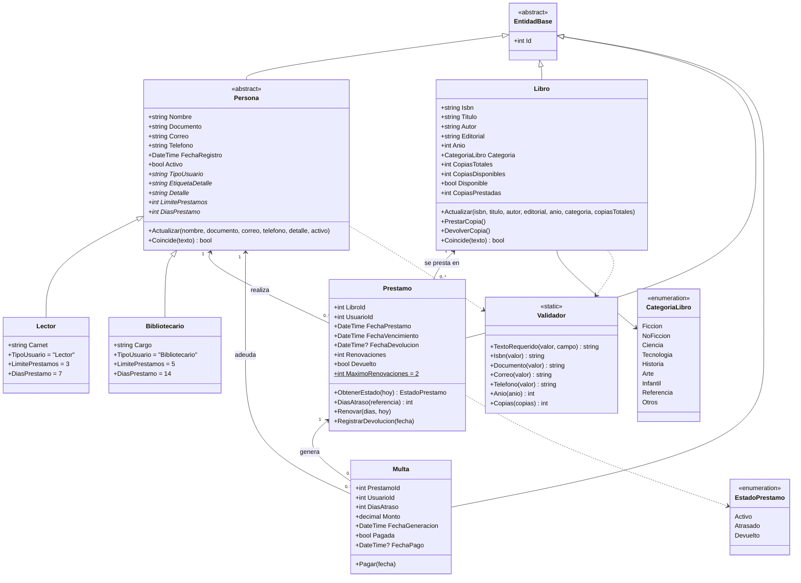
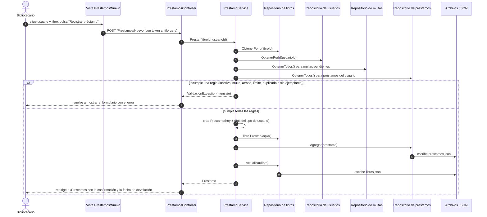
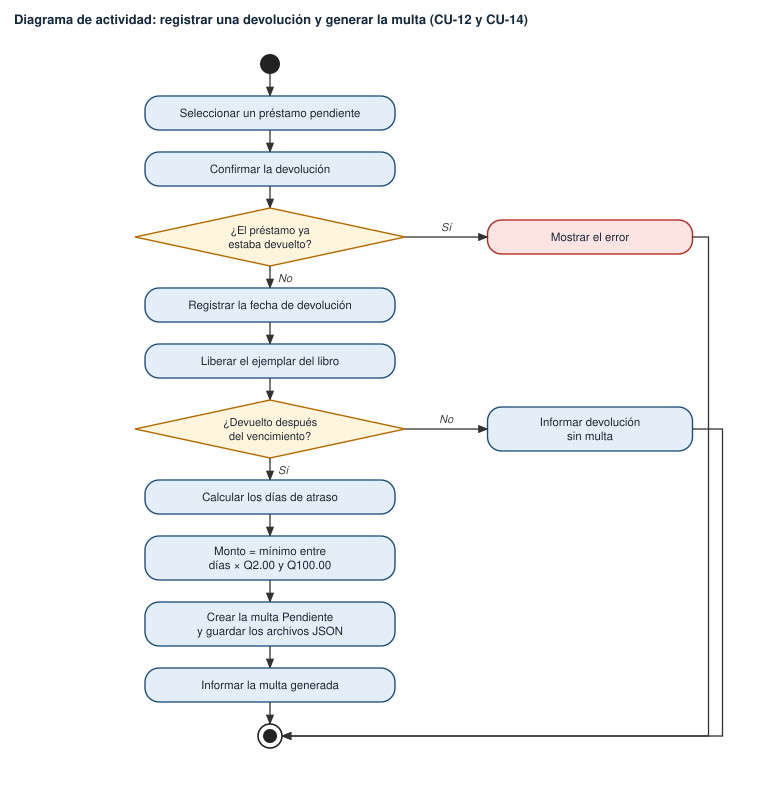
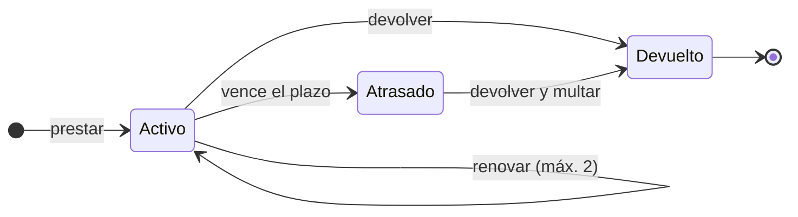
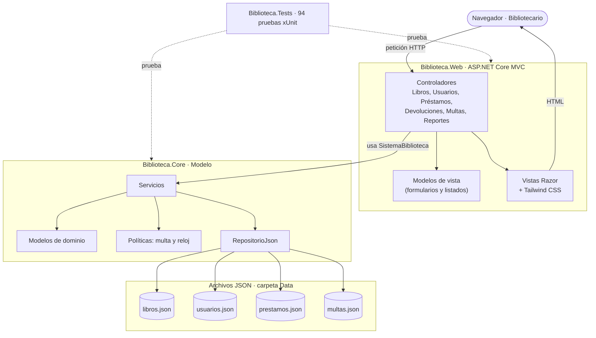

Universidad San Pablo de Guatemala

Programación II

Sistema de Biblioteca Web

Análisis, Modelado UML e Implementación con ASP.NET Core MVC

Autores

<table class="integrantes">
<thead><tr><th>Nombre</th><th>Carné</th></tr></thead>
<tbody>
<tr><td>Angela María Cruz Cifuentes</td><td>2600447</td></tr>
<tr><td>Carlos Fernando Villatoro López</td><td>2600094</td></tr>
<tr><td>Angel Kaled Rodriguez Soc</td><td>2600100</td></tr>
</tbody>
</table>

Catedrático

Erik Arnulfo Santizo Bardales

Fecha de presentación

10 de octubre de 2026

https://github.com/USPG-Angels-Workspace/sistema-biblioteca

<strong>Sistema de Biblioteca Web: Análisis, Modelado UML e Implementación con ASP.NET Core MVC</strong>

# Descripción del Problema

## Situación Actual

Una biblioteca pequeña o universitaria suele administrar sus libros, lectores y préstamos en cuadernos o fichas de papel. Las fechas de devolución se recuerdan a mano y las multas por atraso se calculan de memoria, de modo que el resultado depende de quién atienda el mostrador.

## Problema Identificado

No existe un registro único y consistente que relacione libros, usuarios, préstamos y multas. Como consecuencia, se prestan libros que ya no tienen ejemplares o a usuarios que no deberían recibirlos, los vencimientos y las multas no se controlan de forma uniforme y la generación de reportes es lenta y propensa a errores.

## Propuesta de Solución

Se desarrolló una aplicación web con ASP.NET Core MVC (Microsoft, s. f.) que aplica automáticamente las reglas del servicio, almacena la información en archivos JSON (Bray, 2017) y genera los reportes que necesita el personal de la biblioteca. La interfaz se construyó con Razor y Tailwind CSS (Tailwind Labs, s. f.).

# Objetivos

## Objetivo General

Desarrollar una aplicación web en C# que permita gestionar el catálogo, los usuarios, los préstamos, las devoluciones y las multas de una biblioteca, aplicando análisis orientado a objetos y modelado UML, con almacenamiento en archivos JSON.

## Objetivos Específicos

1. Analizar y documentar los requisitos, los actores y los casos de uso del sistema.
2. Modelar la solución con diagramas UML de casos de uso, clases, secuencia y actividad.
3. Implementar el dominio con programación orientada a objetos: encapsulamiento, herencia, polimorfismo e interfaces.
4. Guardar la información en archivos JSON y recuperarla al reiniciar la aplicación.
5. Construir una interfaz web con formularios, consulta, edición, eliminación, mensajes y validación de datos.
6. Verificar el funcionamiento con pruebas automatizadas y datos de prueba, y versionar el proyecto en GitHub.

# Alcance y Limitaciones

El sistema abarca cinco módulos: libros, usuarios, préstamos, devoluciones y multas, y reportes con exportación a CSV. Entre sus limitaciones, no incluye inicio de sesión; funciona como una sola instancia que atiende una petición a la vez para proteger los archivos JSON; no contempla reservas ni notificaciones; utiliza una única política de multa (Q 2.00 por día con un tope de Q 100.00); y requiere conexión a internet para cargar los estilos, ya que Tailwind CSS se obtiene mediante una red de distribución de contenido.

# Requisitos

Los requisitos se clasificaron en funcionales, que describen lo que el sistema debe hacer, y no funcionales, que describen las cualidades que debe tener (Sommerville, 2011). La Tabla 1 resume los 34 requisitos funcionales agrupados por módulo.

**Tabla 1**

*Requisitos Funcionales por Módulo*

| Módulo | Requisitos |
|---|---|
| Libros (RF-01 a RF-07) | Registrar y editar libros; eliminar solo los que no tienen historial; buscar por título, autor, editorial o ISBN y filtrar por categoría y disponibilidad; controlar la disponibilidad de ejemplares; garantizar un ISBN único. |
| Usuarios (RF-08 a RF-11) | Registrar lectores (con carnet) y bibliotecarios (con cargo); validar DPI de 13 dígitos, correo y teléfono; exigir DPI y carnet únicos; activar, desactivar y eliminar solo usuarios sin historial. |
| Préstamos (RF-12 a RF-17) | Asignar un libro disponible a un usuario activo; calcular el vencimiento (7 días para lectores y 14 para bibliotecarios); limitar los préstamos simultáneos a 3 o 5; bloquear por multas, atrasos o libro repetido; permitir hasta 2 renovaciones; filtrar por estado. |
| Devoluciones y multas (RF-18 a RF-22) | Registrar la devolución y liberar el ejemplar; detectar atrasos; calcular la multa (Q 2.00 por día, tope de Q 100.00); registrar el pago; consultar multas. |
| Reportes (RF-23 a RF-28) | Libros disponibles, préstamos activos, libros atrasados, usuarios y multas, con exportación a CSV. |
| Persistencia (RF-29 a RF-31) | Guardar tras cada cambio, recuperar al iniciar e informar los errores de archivo. |
| Interfaz (RF-32 a RF-34) | Menú principal, formularios con validación y mensajes de error, y confirmaciones. |

*Nota.* RF = requisito funcional. Elaboración propia.

Los requisitos no funcionales establecen que el sistema debe desarrollarse en C# sobre .NET 8 con ASP.NET Core MVC y poder ejecutarse en Windows, Linux y macOS; aplicar programación orientada a objetos con herencia (`Persona` hacia `Lector` y `Bibliotecario`), polimorfismo (límite y plazo de préstamo según el tipo de usuario) e interfaces (`IRepositorio<T>`, `IReloj` e `ICalculadoraMulta`); mantener las reglas de negocio en la capa de lógica y validarlas en el servidor; guardar los datos en JSON con codificación UTF-8 y escritura atómica; y ofrecer una interfaz clara, en español, con pruebas automatizadas y commits que sigan la convención Conventional Commits (Conventional Commits, s. f.).

Las reglas del negocio son las siguientes: un lector puede tener 3 préstamos simultáneos por 7 días y un bibliotecario 5 por 14 días; cada préstamo admite un máximo de 2 renovaciones y solo si no está vencido; la multa es de Q 2.00 por día de atraso con un tope de Q 100.00; y un usuario con multas pendientes o libros atrasados no puede recibir nuevos préstamos.

# Actores

En el sistema intervienen tres actores (ver Tabla 2). El bibliotecario es el actor principal porque es quien opera la aplicación; el lector participa de forma indirecta y es atendido por el bibliotecario; y los archivos JSON actúan como sistema secundario de almacenamiento.

**Tabla 2**

*Actores del Sistema*

| Actor | Tipo | Descripción |
|---|---|---|
| Bibliotecario | Principal | Registra libros y usuarios, presta, renueva, recibe devoluciones, cobra multas y consulta reportes. |
| Lector | Secundario | Solicita libros, los devuelve y paga multas; lo atiende el bibliotecario. |
| Archivos JSON | Sistema | Almacenamiento persistente que se lee al iniciar y se escribe con cada cambio. |

*Nota.* Elaboración propia.

# Casos de Uso

Un caso de uso describe la interacción entre un actor y el sistema para lograr un objetivo (Larman, 2003). Se identificaron 18 casos de uso, representados en la Figura 1 y descritos en la Tabla 3. El caso CU-09 incluye siempre la validación de condiciones (CU-18), y el caso CU-14 extiende a CU-12 únicamente cuando la devolución tiene atraso.

**Figura 1**

*Diagrama de Casos de Uso del Sistema de Biblioteca*

*Nota.* Elaboración propia.

**Tabla 3**

*Casos de Uso por Módulo y su Flujo Principal*

| Módulo | Casos de uso | Flujo principal |
|---|---|---|
| Libros | CU-01 Registrar, CU-02 Editar, CU-03 Eliminar, CU-04 Buscar y clasificar | El bibliotecario llena el formulario; el sistema valida los datos (ISBN único, formatos) y guarda en `libros.json`; si hay un error lo muestra sin guardar. |
| Usuarios | CU-05 Registrar, CU-06 Editar o desactivar, CU-07 Eliminar, CU-08 Consultar | Igual que en libros, con validación de DPI, correo y teléfono y unicidad de DPI y carnet; no se elimina a quien tiene historial. |
| Préstamos | CU-09 Registrar, CU-10 Renovar, CU-11 Consultar, CU-18 Validar condiciones | Se elige usuario y libro; el sistema valida las reglas, descuenta un ejemplar, fija el vencimiento y guarda; si no se cumplen, muestra el motivo. |
| Devoluciones y multas | CU-12 Registrar devolución, CU-13 Controlar vencimientos, CU-14 Generar multa, CU-15 Pagar multa, CU-16 Consultar multas | Se registra la devolución y se libera el ejemplar; con atraso se calcula la multa y queda pendiente, bloqueando al usuario hasta que la pague. |
| Reportes | CU-17 Generar y exportar | Se elige el reporte, el sistema lo calcula con los datos actuales y permite descargarlo en CSV. |

*Nota.* Elaboración propia.

# Modelado UML

El modelado se realizó con el lenguaje UML en su versión 2.5.1 (Object Management Group [OMG], 2017). Además del diagrama de casos de uso ya presentado, se elaboraron diagramas de clases, secuencia, actividad y estados, y un diagrama de la arquitectura.

## Diagrama de Clases

La Figura 2 muestra el modelo de dominio. `EntidadBase` aporta el identificador de todo objeto que se guarda en JSON; `Persona` es una clase abstracta de la que heredan `Lector` y `Bibliotecario`, que definen por polimorfismo el límite y el plazo de préstamo; y `Libro`, `Prestamo` y `Multa` se relacionan mediante identificadores.

**Figura 2**

*Diagrama de Clases del Dominio*

*Nota.* Elaboración propia.

## Diagrama de Secuencia

La Figura 3 detalla el registro de un préstamo: el formulario envía la petición al controlador, este invoca al servicio, el servicio consulta los repositorios y valida las reglas y, si todas se cumplen, guarda los archivos y redirige con un mensaje de confirmación.

**Figura 3**

*Diagrama de Secuencia para Registrar un Préstamo*

*Nota.* Elaboración propia.

## Diagrama de Actividad

La Figura 4 presenta el proceso de devolución. Cuando el libro se entrega después del vencimiento, el sistema calcula los días de atraso y crea una multa pendiente cuyo monto es el menor valor entre los días de atraso por Q 2.00 y Q 100.00.

**Figura 4**

*Diagrama de Actividad para Registrar una Devolución y Generar la Multa*

*Nota.* Elaboración propia.

## Diagrama de Estados

Un préstamo nace en estado *Activo*, pasa a *Atrasado* cuando vence el plazo y termina en *Devuelto* (ver Figura 5). Mientras está activo puede renovarse hasta dos veces.

**Figura 5**

*Diagrama de Estados del Préstamo*

*Nota.* Elaboración propia.

## Arquitectura de la Solución

La aplicación sigue el patrón Modelo-Vista-Controlador de ASP.NET Core (Microsoft, s. f.), como se observa en la Figura 6. El modelo es la biblioteca `Biblioteca.Core` (dominio, servicios y acceso a JSON); los controladores reciben la petición, llaman a los servicios y eligen la vista; y las vistas son páginas Razor. El modelo no depende de la capa web, por lo que puede probarse sin abrir un navegador.

**Figura 6**

*Arquitectura MVC de la Aplicación*

*Nota.* Elaboración propia.

# Descripción de las Principales Clases

La Tabla 4 resume las clases principales y su responsabilidad. Los servicios dependen de interfaces, lo que permite sustituir el almacenamiento, controlar la fecha en las pruebas y cambiar la política de multa sin modificar el resto del sistema.

**Tabla 4**

*Principales Clases y su Responsabilidad*

| Clase | Responsabilidad |
|---|---|
| `EntidadBase` (abstracta) | Aporta el identificador `Id` a todo lo que se guarda en JSON. |
| `Persona` (abstracta), `Lector`, `Bibliotecario` | Datos y validación de personas; `LimitePrestamos` y `DiasPrestamo` valen 3 y 7 para el lector y 5 y 14 para el bibliotecario. |
| `Libro` | Catálogo con inventario: `PrestarCopia`, `DevolverCopia`, `Actualizar` y `Coincide`. |
| `Prestamo` | Fechas y estado (`ObtenerEstado`), `Renovar` (máximo 2), `RegistrarDevolucion` y `DiasAtraso`. |
| `Multa` | Cobro por atraso: monto, estado y `Pagar`. |
| `IRepositorio<T>`, `RepositorioJson<T>` | Acceso genérico a datos: lee el JSON al iniciar y lo reescribe de forma atómica en cada cambio. |
| `LibroService`, `UsuarioService`, `PrestamoService`, `DevolucionService`, `MultaService`, `ReporteService` | Lógica y reglas de negocio; `SistemaBiblioteca` las agrupa. |
| `ICalculadoraMulta`, `MultaPorDia`, `IReloj` | Política de multa intercambiable y fecha controlable en las pruebas. |
| Controladores | Reciben las peticiones, llaman a los servicios y devuelven la vista; `BaseController` traduce los errores de negocio en mensajes. |

*Nota.* Elaboración propia.

# Implementación, Pruebas y Trazabilidad

## Persistencia en Archivos JSON

La información se almacena en cuatro archivos (`libros.json`, `usuarios.json`, `prestamos.json` y `multas.json`) dentro de la carpeta `Data/`. Cada cambio se escribe primero en un archivo temporal que luego reemplaza al original, de modo que una falla a mitad de la escritura no deja un archivo dañado. Al iniciar, la aplicación carga los archivos, por lo que los datos permanecen entre ejecuciones. Los datos de prueba incluyen 16 libros, 8 usuarios, 12 préstamos y 2 multas que cubren todos los estados posibles.

## Interfaz Web

La interfaz ofrece un menú lateral, formularios de registro y edición, tablas con búsqueda y filtros, confirmaciones antes de eliminar, renovar, devolver o cobrar, y mensajes de error dentro de los formularios. Todas las validaciones se realizan en el servidor.

## Pruebas

Se implementaron 94 pruebas automatizadas con xUnit: 70 de dominio, servicios y persistencia, y 24 de integración que ejecutan la aplicación web completa. Además, se recorrió el flujo completo de préstamo, devolución con multa y pago en un navegador automatizado.

## Trazabilidad

La Tabla 5 relaciona cada módulo con sus requisitos, casos de uso, clases, controlador, archivo de datos y pruebas, lo que demuestra la cadena entre el problema, el análisis, el diseño, el código y la verificación.

**Tabla 5**

*Trazabilidad entre Requisitos, Diseño, Código y Pruebas*

| Módulo | Requisitos y casos de uso | Clases | Controlador | Archivo | Pruebas |
|---|---|---|---|---|---|
| Libros | RF-01 a 07 CU-01 a 04 | `Libro`, `LibroService` | `LibrosController` | `libros.json` | `LibroTests`, `LibroServiceTests` |
| Usuarios | RF-08 a 11 CU-05 a 08 | `Persona`, `Lector`, `Bibliotecario`, `UsuarioService` | `UsuariosController` | `usuarios.json` | `PersonaTests`, `UsuarioServiceTests` |
| Préstamos | RF-12 a 17 CU-09 a 11 y 18 | `Prestamo`, `PrestamoService` | `PrestamosController` | `prestamos.json` | `PrestamoTests`, `PrestamoFlujoTests` |
| Devoluciones y multas | RF-18 a 22 CU-12 a 16 | `DevolucionService`, `MultaService`, `Multa` | `DevolucionesController`, `MultasController` | `multas.json` | `MultaTests`, `PrestamoFlujoTests` |
| Reportes | RF-23 a 28 CU-17 | `ReporteService` | `ReportesController` | Los cuatro archivos | `ReporteServiceTests` |
| Persistencia e interfaz | RF-29 a 34 | `RepositorioJson<T>`, `BaseController` | Diseño general y formularios | `Data/*.json` | `PersistenciaTests`, `WebTests` |

*Nota.* Elaboración propia.

# Referencias

Bray, T. (Ed.). (2017). <em>The JavaScript Object Notation (JSON) data interchange format</em> (RFC 8259). Internet Engineering Task Force. https://www.rfc-editor.org/info/rfc8259

Conventional Commits. (s. f.). <em>Conventional Commits 1.0.0</em>. https://www.conventionalcommits.org/es/v1.0.0/

Larman, C. (2003). <em>UML y patrones: Una introducción al análisis y diseño orientado a objetos y al proceso unificado</em> (2.ª ed.). Pearson Educación.

Microsoft. (s. f.). <em>Información general sobre ASP.NET Core MVC</em>. Microsoft Learn. https://learn.microsoft.com/es-es/aspnet/core/mvc/overview

Object Management Group. (2017). <em>Unified modeling language (UML)</em> (Versión 2.5.1). https://www.omg.org/spec/UML/2.5.1/PDF

Sommerville, I. (2011). <em>Ingeniería de software</em> (9.ª ed.). Pearson Educación.

Tailwind Labs. (s. f.). <em>Tailwind CSS documentation</em>. https://tailwindcss.com/docs

