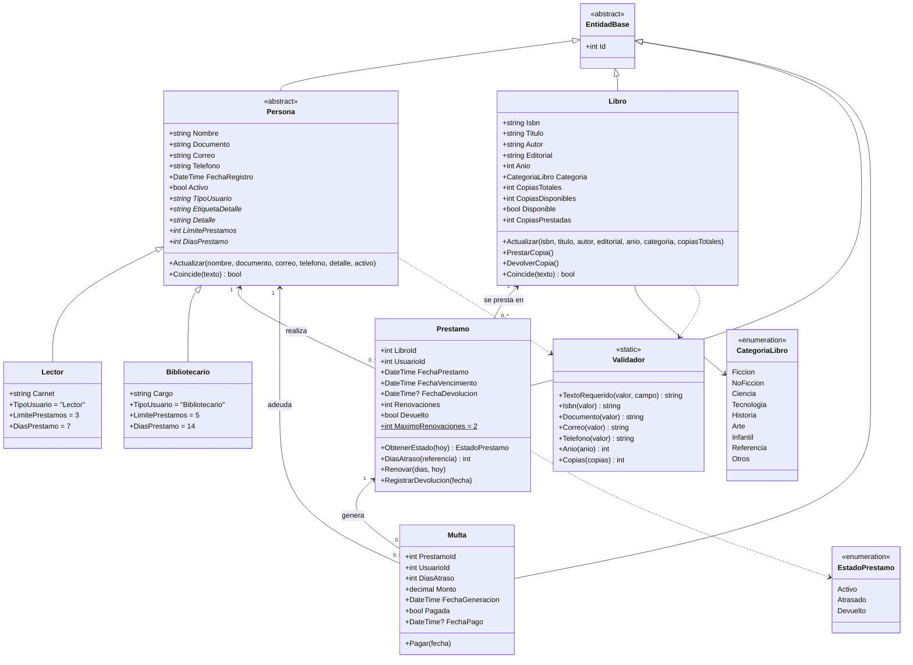
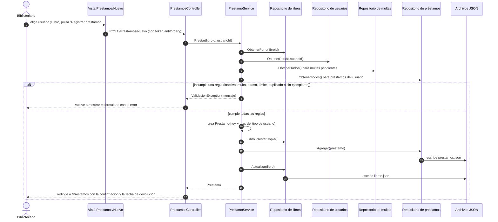
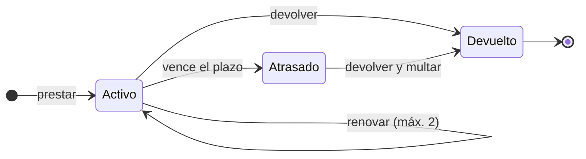
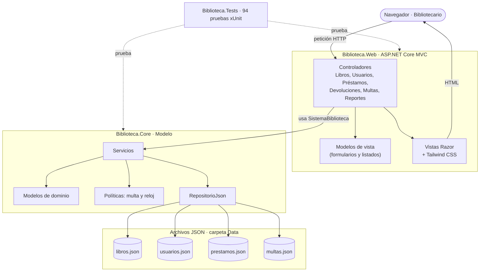

# 1. Descripción del problema

**Situación actual.** Una biblioteca administra sus libros, lectores y préstamos en cuadernos o fichas de papel; las fechas de devolución y las multas se calculan a mano.

**Problema identificado.** No existe un registro único que relacione libros, usuarios, préstamos y multas. Por eso se prestan libros sin ejemplares o a quien no debe recibirlos, los vencimientos y las multas no se controlan de forma uniforme y los reportes son lentos y propensos a error.

**Propuesta de solución.** Una aplicación web ASP.NET Core MVC (C#, .NET 8) que aplica automáticamente las reglas del servicio, guarda la información en archivos JSON y genera los reportes que necesita el personal.

## Objetivos

**General.** Desarrollar una aplicación web en C# que gestione el catálogo, los usuarios, los préstamos, las devoluciones y las multas de una biblioteca, aplicando análisis orientado a objetos y UML, con almacenamiento en archivos JSON.

**Específicos.** (1) Analizar y documentar requisitos, actores y casos de uso. (2) Modelar la solución con UML: casos de uso, clases, secuencia y actividad. (3) Implementar el dominio con POO: encapsulamiento, herencia, polimorfismo e interfaces. (4) Guardar y recuperar la información en JSON. (5) Construir una interfaz web con formularios, consulta, edición, eliminación, mensajes y validación. (6) Verificar con pruebas automatizadas y datos de prueba, y versionar en GitHub.

## Alcance y limitaciones

**Alcance:** cinco módulos: libros, usuarios, préstamos, devoluciones y multas, y reportes (con exportación a CSV).
**Limitaciones:** sin inicio de sesión; una sola instancia que atiende una petición a la vez (protege los archivos JSON); sin reservas ni notificaciones; una única política de multa (Q2.00 por día, tope Q100.00); requiere internet para los estilos (Tailwind CSS por CDN).

# 2. Requisitos

## Requisitos funcionales

| Módulo | Requisitos |
|---|---|
| Libros (RF-01 a RF-07) | Registrar y editar libros (los ejemplares no pueden ser menos que los prestados); eliminar solo sin historial; buscar por título, autor, editorial o ISBN y filtrar por categoría y disponibilidad; disponibilidad automática; ISBN único. |
| Usuarios (RF-08 a RF-11) | Registrar lectores (carnet) y bibliotecarios (cargo); validar DPI de 13 dígitos, correo y teléfono; DPI y carnet únicos; activar o desactivar; eliminar solo sin historial. |
| Préstamos (RF-12 a RF-17) | Asignar un libro disponible a un usuario activo; vencimiento automático (7 días lector, 14 bibliotecario); máximo 3 o 5 préstamos simultáneos; bloqueo por multas, atrasos o libro repetido; hasta 2 renovaciones; filtrar por estado. |
| Devoluciones y multas (RF-18 a RF-22) | Registrar la devolución y liberar el ejemplar; detectar atrasos; multa de Q2.00 por día (tope Q100.00); registrar el pago; consultar multas. |
| Reportes (RF-23 a RF-28) | Libros disponibles, préstamos activos, libros atrasados, usuarios y multas; exportar a CSV. |
| Persistencia (RF-29 a RF-31) | Guardar tras cada cambio, recuperar al iniciar e informar los errores de archivo. |
| Interfaz (RF-32 a RF-34) | Menú principal, formularios con validación y mensajes de error, y confirmaciones. |

## Requisitos no funcionales

- **Tecnología:** C# sobre .NET 8, con ASP.NET Core MVC; portable a Windows, Linux y macOS.
- **Diseño:** POO con herencia (`Persona` → `Lector` / `Bibliotecario`), polimorfismo (límite y plazo por tipo de usuario) e interfaces (`IRepositorio<T>`, `IReloj`, `ICalculadoraMulta`).
- **Integridad:** las reglas de negocio están en la capa de lógica y se validan en el servidor; ningún dato inválido llega a los archivos.
- **Persistencia:** archivos JSON en UTF-8 con escritura atómica (archivo temporal y reemplazo).
- **Calidad:** interfaz clara y en español, pruebas automatizadas y commits en GitHub (Conventional Commits).

**Reglas del negocio:** lector: 3 préstamos y 7 días; bibliotecario: 5 préstamos y 14 días; máximo 2 renovaciones, solo si no está vencido; multa de Q2.00 por día con tope de Q100.00; con multas pendientes o libros atrasados no se presta.

# 3. Actores

| Actor | Descripción |
|---|---|
| **Bibliotecario** (principal) | Opera el sistema: registra libros y usuarios, presta, renueva, recibe devoluciones, cobra multas y consulta reportes. |
| **Lector** (secundario) | Solicita libros, los devuelve y paga multas; lo atiende el bibliotecario. |
| **Archivos JSON** (sistema) | Almacenamiento persistente que se lee al iniciar y se escribe con cada cambio. |

# 4. Casos de uso

| Módulo | Casos de uso | Flujo principal |
|---|---|---|
| Libros | CU-01 Registrar, CU-02 Editar, CU-03 Eliminar, CU-04 Buscar y clasificar | El bibliotecario abre el formulario, llena los datos; el sistema valida (ISBN único, formatos) y guarda en `libros.json`; si hay error lo muestra sin guardar. |
| Usuarios | CU-05 Registrar, CU-06 Editar o desactivar, CU-07 Eliminar, CU-08 Consultar | Igual que libros, con validación de DPI, correo, teléfono y unicidad de DPI y carnet; no se elimina a quien tiene historial. |
| Préstamos | CU-09 Registrar, CU-10 Renovar, CU-11 Consultar; CU-18 Validar condiciones (incluido en CU-09) | Se elige usuario y libro; el sistema valida las reglas (activo, sin multas ni atrasos, dentro del límite, libro no repetido, con ejemplares), descuenta un ejemplar, fija el vencimiento y guarda; si no cumple, muestra el motivo. |
| Devoluciones y multas | CU-12 Registrar devolución, CU-13 Controlar vencimientos, CU-14 Generar multa (extiende CU-12 si hay atraso), CU-15 Pagar multa, CU-16 Consultar multas | Se registra la fecha de devolución y se libera el ejemplar; con atraso se calcula la multa (Q2.00 por día, tope Q100.00) y queda pendiente, bloqueando al usuario hasta pagarla. |
| Reportes | CU-17 Generar y exportar | Se elige el reporte, el sistema lo calcula con los datos actuales y permite descargarlo en CSV. |

# 5. Diagramas UML

## Diagrama de clases del dominio

## Diagrama de secuencia: registrar un préstamo (CU-09)

## Diagrama de actividad: registrar una devolución y generar la multa

## Diagrama de estados del préstamo

## Arquitectura: patrón MVC

El **Modelo** es `Biblioteca.Core` (dominio, servicios y JSON); los **Controladores** reciben la petición, llaman a los servicios y eligen la vista; las **Vistas** son páginas Razor con Tailwind CSS.

# 6. Descripción de las principales clases

| Clase | Responsabilidad |
|---|---|
| `EntidadBase` (abstracta) | Aporta el `Id` a todo lo que se guarda en JSON. |
| `Persona` (abstracta), `Lector`, `Bibliotecario` | Datos y validación de personas. Por polimorfismo, `LimitePrestamos` y `DiasPrestamo` valen 3 y 7 para el lector, 5 y 14 para el bibliotecario. |
| `Libro` | Catálogo con inventario: `PrestarCopia`, `DevolverCopia`, `Actualizar`, `Coincide`. |
| `Prestamo` | Fechas y estado (`ObtenerEstado`), `Renovar` (máximo 2), `RegistrarDevolucion`, `DiasAtraso`. |
| `Multa` | Cobro por atraso: monto, estado y `Pagar`. |
| `IRepositorio<T>` / `RepositorioJson<T>` | Acceso a datos genérico: lee el JSON al iniciar y lo reescribe de forma atómica en cada cambio. |
| `LibroService`, `UsuarioService`, `PrestamoService`, `DevolucionService`, `MultaService`, `ReporteService` | Lógica de negocio y reglas; `SistemaBiblioteca` las agrupa. |
| `ICalculadoraMulta` / `MultaPorDia`, `IReloj` | Política de multa intercambiable y fecha controlable en las pruebas. |
| Controladores (`Libros`, `Usuarios`, `Prestamos`, `Devoluciones`, `Multas`, `Reportes`, `Home`) | Reciben peticiones, llaman a los servicios y devuelven la vista; `BaseController` traduce los errores de negocio a mensajes. |

# 7. Implementación, pruebas y trazabilidad

**Persistencia.** Cuatro archivos en `Data/`: `libros.json`, `usuarios.json`, `prestamos.json` y `multas.json`. Cada cambio se escribe en un archivo temporal que luego reemplaza al original; al iniciar se cargan de nuevo, por lo que los datos permanecen. Incluyen datos de prueba: 16 libros, 8 usuarios, 12 préstamos y 2 multas con todos los estados.

**Interfaz.** Menú lateral, formularios de registro y edición, tablas con búsqueda y filtros, confirmaciones antes de eliminar, renovar, devolver o cobrar, y errores dentro del formulario.

Las capturas de cada pantalla están en `docs/img` y en el capítulo de interfaz del anexo.

**Pruebas.** 94 pruebas automatizadas (xUnit): 70 de dominio, servicios y persistencia y 24 de integración que ejecutan la aplicación web completa.

**Trazabilidad** (Problema → Requisitos → UML → Clases → Código → Interfaz → Archivos → Pruebas):

| Módulo | Requisitos y casos de uso | Clases | Controlador | Archivo | Pruebas |
|---|---|---|---|---|---|
| Libros | RF-01 a 07 · CU-01 a 04 | `Libro`, `LibroService` | `LibrosController` | `libros.json` | `LibroTests`, `LibroServiceTests` |
| Usuarios | RF-08 a 11 · CU-05 a 08 | `Persona`, `Lector`, `Bibliotecario`, `UsuarioService` | `UsuariosController` | `usuarios.json` | `PersonaTests`, `UsuarioServiceTests` |
| Préstamos | RF-12 a 17 · CU-09 a 11, 18 | `Prestamo`, `PrestamoService` | `PrestamosController` | `prestamos.json` | `PrestamoTests`, `PrestamoFlujoTests` |
| Devoluciones y multas | RF-18 a 22 · CU-12 a 16 | `DevolucionService`, `MultaService`, `Multa` | `DevolucionesController`, `MultasController` | `multas.json` | `MultaTests`, `PrestamoFlujoTests` |
| Reportes | RF-23 a 28 · CU-17 | `ReporteService` | `ReportesController` | (los cuatro) | `ReporteServiceTests` |
| Persistencia e interfaz | RF-29 a 34 | `RepositorioJson<T>`, `BaseController` | `_Layout`, formularios | `Data/*.json` | `PersistenciaTests`, `WebTests` |

**Repositorio y ejecución.** <https://github.com/USPG-Angels-Workspace/sistema-biblioteca> · `dotnet run` y abrir `http://localhost:5110`. El detalle completo (especificación de cada caso de uso, más diagramas y capturas) está en los archivos Markdown de `docs/`.
